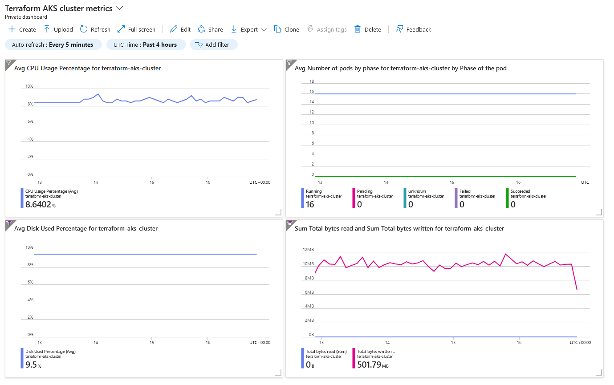
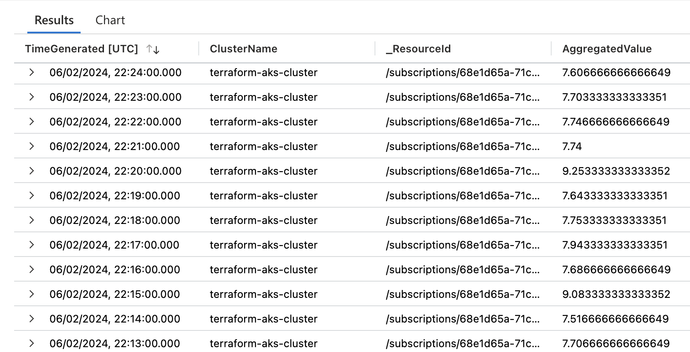
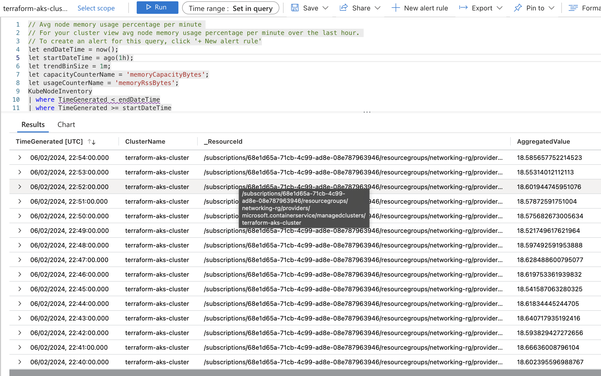
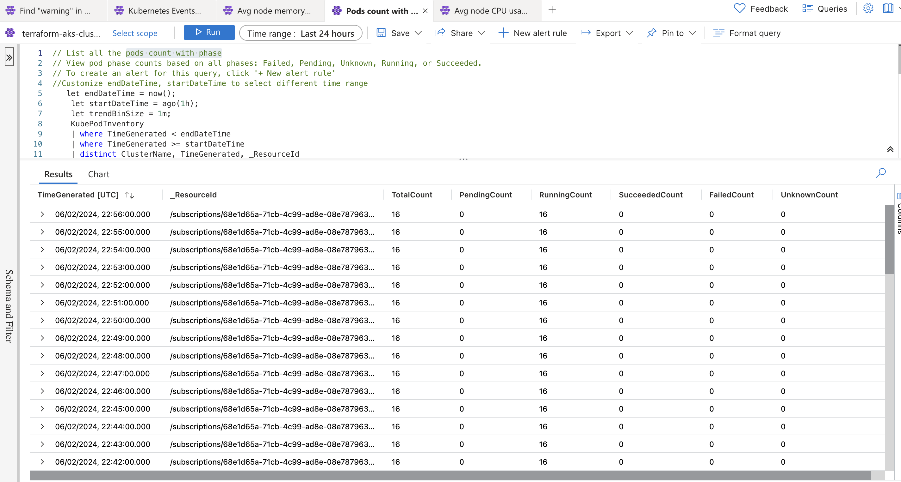
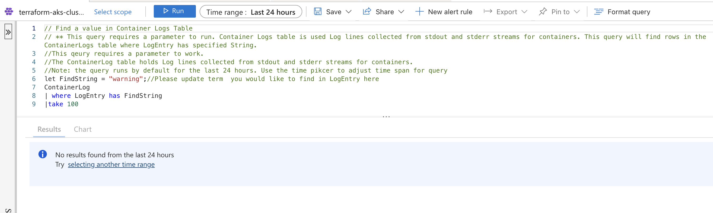
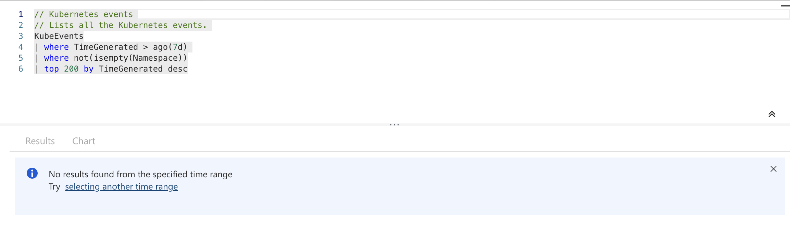
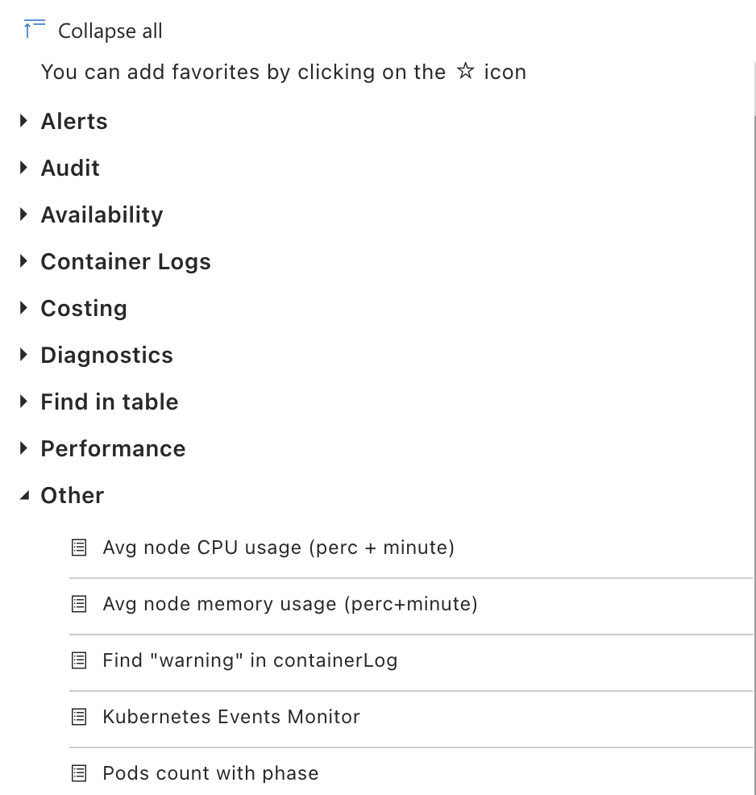
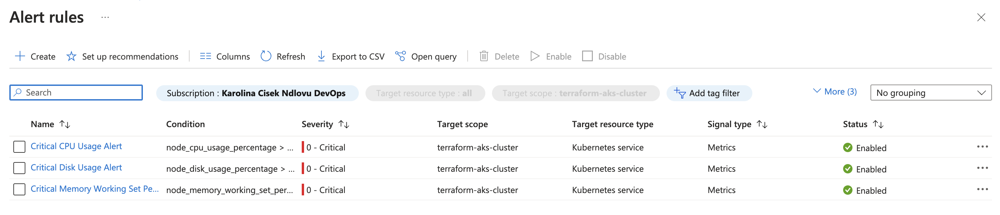

# Cluster Monitoring 

Accessing all features of Azure Monitor requires activation of Insights, which in turn requires enabling Managed Identity. 
> _NOTE that this will remove Service Principal from all elements of the cluster apart from `kubelet`. More information about Managed Identity can be found [here](https://learn.microsoft.com/en-us/azure/aks/use-managed-identity#enable-managed-identities-on-an-existing-aks-cluster)_.

Managed identity for this project was set up the command:

    az aks update -g networking-rg -n terraform-aks-cluster --enable-managed-identity

## Metrics and Insights

Metrics monitored in this clusters include:
- Average Node CPU Usage: tracks how much CPU is sued by the node as a % of its total capacity. Tracking this metrics helps detect potential performance issues and make informed decisions on efficient resource allocation, scaling and optimisations.
- Average Number of Pods per Phase (grouped by phase): this metric offers visibility into distribution of pods across different lifecycle phases. It is important for evaluating the cluster's capacity and workload distribution and can help assess workload scheduling efficiency as well as potential bottlenecks. This helps with managing workload management and their optimisation.
- Used Disk Percentage: monitoring disk space usage is crucial in preventing storage-related issues and outages due to lack of space, and provides important insights needed for capacity planning.
- Bytes Read and Written per Second: gives insight into the I/O (input/output) activity on the cluster and is crucial for identifying performance bottlenecks.

Graphs for the metrics above have been saved to a dashboard for easy access.

## Logs queries
To support the metrics described above, several log queries were also set up and saved to help with diagnostics and cluster monitoring. 

### Average Node CPU Usage Percentage per Minute
This query calculates the average CPU usage percentage across all nodes per minute. In conjunction with the CPU metrics chart above, it helps understand the overall CPU resource utilization of the cluster. Over time, this can help identify periods of high resource usage, potential bottlenecks, and even underutilised resources. It also enables proactive capacity planning and optimization efforts to ensure optimal performance and resource allocation within the cluster.

### Average Node Memory Usage Percentage per Minute
This query computes the average memory usage percentage across all nodes in the Kubernetes cluster per minute. Monitoring memory usage is crucial for detecting memory-intensive workloads, memory leaks, and potentially running out of memory that can impact the stability and performance of applications running in the cluster. Monitoring memory usage trends helps identify inefficiencies, optimise resource allocation, and prevent resource exhaustion.

### Pods Counts with Phase
This query provides counts of the number of pods in each phase (e.g., Pending, Running, Succeeded, Failed). Monitoring pod counts with their respective phases helps assess the health and status of applications deployed in the cluster. For example, it helps to pick up anomalies such as a high number of pending pods or a sudden increase in failed pods, indicating issues with resource availability, scheduling, or application failures.

### Find Warning Value in Container Logs
This query searches container logs for messages containing "warning" value. Identifying warning or error indicators allows proactive detection and troubleshooting of issues related to application health, configuration errors, software bugs, or performance issues. It also helps in diagnosing and resolving issues promptly, ensuring the reliability and stability of deployed applications.

### Monitoring Kubernetes Events
This query captures Kubernetes events generated by various components and activities within the cluster, such as pod scheduling, creations, deletions, node status changes, scaling activities and errors. Monitoring Kubernetes events can be used to track system events, diagnose problems, audit cluster activities, and ensure compliance with operational policies and best practices. 

All the above queries were saved for easy retrieval when needed in the future.

## Alarms
Setting up alerts in Azure Monitor based on thresholds for certain metrics, enables proactive monitoring and responding to potential issues before they escalate. 
Alerts set up in this project monitor the utilisation of node's disk, CPU, and memory.

### Disk usage alert

**SETTINGS**: 
|   |   |
|---|---|
|Signal name |Disk Used Percentage|
|Threshold |Static, greater than 90%|
|Checks every |5 mins|
|Loopback period|15 mins|
|Action |Email sent to Critical Alerts Response Group|
|Severity |Critical|

**Potential response procedure**:

- Identify the pod(s) or node(s) causing high disk usage.
- Analyze logs and events related to the affected pod(s) or node(s) to determine the cause of the issue (e.g., excessive logging, large file uploads).
- If possible, optimise storage usage by deleting, archiving or moving unnecessary files.
- Consider scaling the storage volumes or nodes to accommodate increased disk usage if optimization is not sufficient.
- Document issue, cause and solution.

### CPU usage alert: 

**SETTINGS**: 
|   |   |
|---|---|
|Signal name |CPU Usage Percentage|
|Threshold |Static, greater than 80%|
|Checks every |5 mins|
|Loopback period|15 mins|
|Action |Email sent to Critical Alerts Response Group|
|Severity |Critical|

**Potential response procedure**:
- Identify the pod(s) or deployment(s) causing high CPU usage.
- Check metrics and logs and analyse application performance and resource consumption within the affected pod(s).
- If applicable, you can try to optimise application code to reduce CPU load.
- Scale horizontally by adding more replicas to distribute the workload.
- If the above is not effective, consider vertical scaling by upgrading the nodes to higher CPU configurations.
- Document issue, cause and solution.

### Memory working set alert:

**SETTINGS**: 
|   |   |
|---|---|
|Signal name |Memory Working Set Percentage|
|Threshold |Static, greater than 80%|
|Checks every |5 mins|
|Loopback period|15 mins|
|Action |Email sent to Critical Alerts Response Group|
|Severity |Critical|

**Potential response procedure**:
- As with previous alerts, first determine which pod(s) or deployment(s) are consuming excessive memory.
- Use metrics and logs to analyze memory utilization patterns and application behaviour within the affected pod(s).
- Review configurations and resource requests to optimise application memory usage.
- Scale horizontally by adding more replicas to further distribute the workload.
- If this doesn't help, scale resources vertically by allocating more memory to the nodes.
- It might be also worth considering to increase the pod eviction threshold or implementing resource quotas to prevent excessive memory usage.
- Document issue, cause and solution.

---
 

>To aid prompt resolution of issues it is a good idea to implement automation scripts or set up Azure Alerts Tasks set up to automatically trigger remediation actions such as scaling, restarting pods, or adjusting resource allocations. It is also important to periodically review historical data to assess whether alarm thresholds need adjustment and review, optimise and clean up resources (e.g. optimise docker images, remove files or processes that are no longer needed etc.). Regularly reviewing Azure Advisor recommendations is also a good way to explore what can be done to optimise the cluster.

