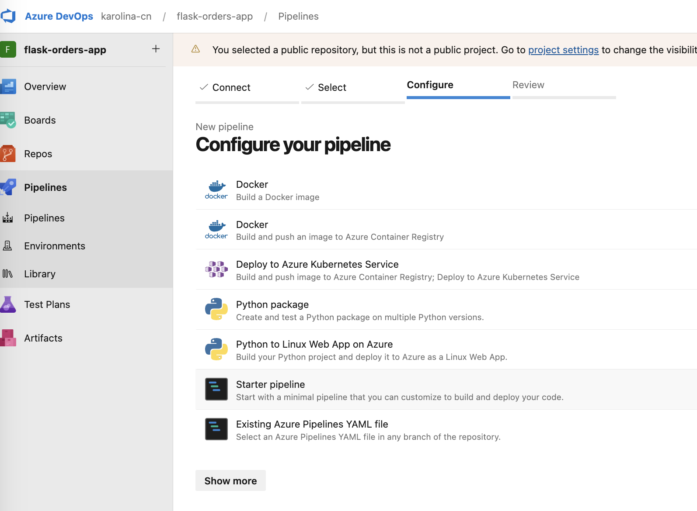
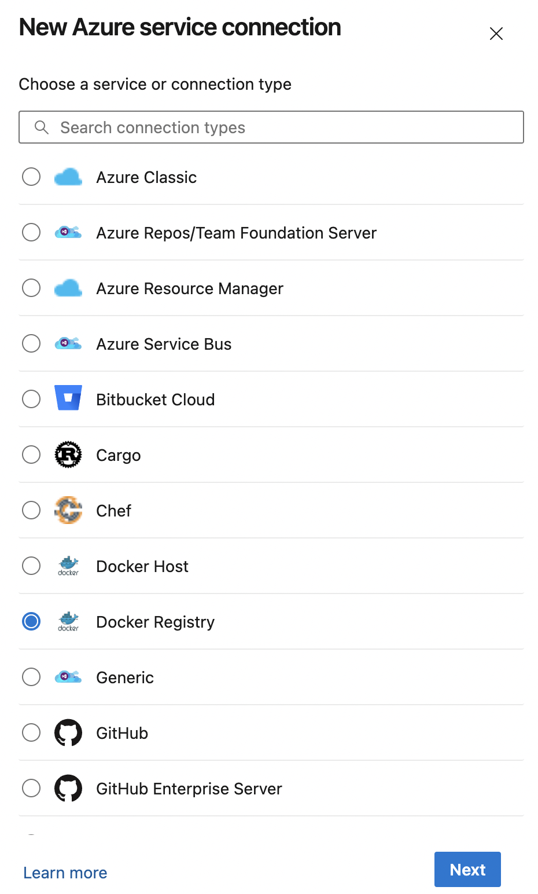
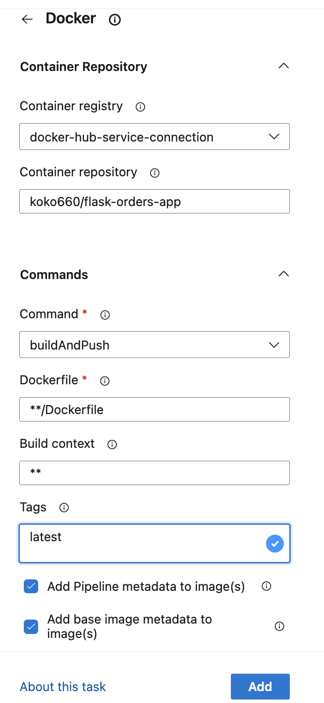
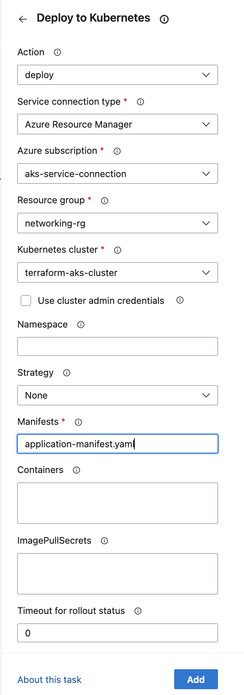
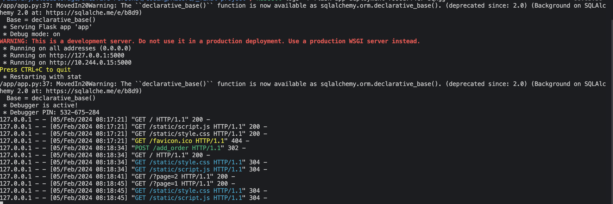

# Azure DevOps Pipeline configuration

The project uses Pipelines for two purposes: 
1. To build and push the Docker image each time there is a change to the code.
2. To redeploy the cluster and its elements each time there is a change.

## Setting up the Pipeline

The first step in creating the new Pipeline for the project, was to select GitHub as the code source, connecting to the GitHub repo and selecting a Starter Pipeline to provide the initial implementation template.

The two elements that retained from the template are: 
- `trigger`, set to `main` meaning that the pipeline yaml file will run each time there are changes to the `main` branch.
- `pool`, specifying the virtual machine or container environment where the pipeline's tasks will run, in our case this is the 'ubuntu-latest' image.

## Setting up the service connections

The two tasks run by the pipeline require setting up two service connections - one between Azure DevOps and Docker Hub where the app image is stored, and another between Azure DevOps and Azure Resource Manager, which facilitates connection to AKS cluster.

### * Docker Hub
The authorisation process for accessing the Docker Hub account, requires a personal access token (to be used as password when setting up the connection), which can be obtained by accessing `Account > Security > Access tokens` in  Docker Hub.

The service connection was then set up by:
- selecting Docker Registry as the type of connection
- selecting Docker Hub as Registry type
- providing the name of the Docker account where the image is stored as DockerID

The setup was verified to ensure connection can be established.

### * Azure Resource Manager
Connection of Azure DevOps with the AKS cluster requires Azure Resource Manager service connection. This was set up using the following options:
- **Workload Identity federation** (recommended) as the authentication method 
- **Subscription as the scope level**, ensuring the selected subscription is where the app resources are provisioned
- selected the resource group where the cluster is provisioned

Once again, the connection was verified firstly by the appearance of correct resource group and secondly by monitoring Azure messages.

Both service connections were named in a meaningful way allowing their easy identification.

### Build pipeline
In order to keep the Docker image up to date, a Build Pipeline was added to the CI/CD configuration to push the code to Docker Hub with each change to the `main` branch (controlled by the `trigger` value set to `main` as mentioned above).
This was achieved by editing the Simple Pipeline yaml configuration template and adding a new Docker task to run buildandPush command, with the following settings:

    

        <ul>
            <li>The <strong>Container Registry</strong> selected was set to the Docker Hub service connection</li>
            <li><strong>Repository</strong> is the name of the repository where the image resides- command, `buildAndPush`, builds the image and then pushes it to the repo</li>
            <li><strong>Tags</strong> setting labels each new build with 'latest' tag</li>
            <li>Remaining settings were left as their default configurations.</li>
        </ul>
    

    

        
    

Once set up, the CI/CD pipeline was run to verify the settings. In order to test the newly pushed image, it was run locally using the following command `docker run -p 5000:5000 koko660/flask-orders-app:latest` and the app's functionality was tested once again. 

### Release pipeline
Adding he Release Pipeline to the CI/CD process, ensures that deployed code reflects the most recent code pushed to the `main` branch. 
This was achieved by setting up a _Deploy to Kubernetes_ task using the following settings:

    

        <ul>
            <li><strong>Action</strong> set to 'deploy'</li>
            <li><strong>Service connection type</strong> set to the Azure Resource Manager and <strong>Azure subscription</strong> to the service connection created previously</li>
            <li>The selected <strong>Resource group</strong> and <strong>Kubernetes cluster</strong> match the resources where the application is to be provisioned.</li>
            <li><strong>Manifests</strong> set to the <em>application-manifest.yaml</em> file, containing Kubernetes deployment.</li>
            <li>Remaining settings were left as default.</li>
        </ul>
    

    

        
    

The resulting Pipeline yml file is available in this project [here](../azure-pipelines.yml).

## Testing the pipeline
The two tasks create a complete CI/CD pipeline for this project which was then tested by: 
- Investigating the status of pods to ensure they have been created correctly after running the pipeline. 
- Accessing the application locally using the port forwarding method and testing its functionality.
- Checking pods logs using `kubectl logs -f <pod-name>` command to ensure application is running correctly (log output shown below).
  

### Issues revealed during testing:

After the first run, the pods `AGE` was still showing as that from previous deployment, which meant that the pods were not recreated as expected. This was caused by the application-manifest.yaml specifying the container image as having a tag 'v1.0', while the updated images are tagged as 'latest'. Removing the tag from the manifest ensured that the latest image is being used and resolved the issue.

