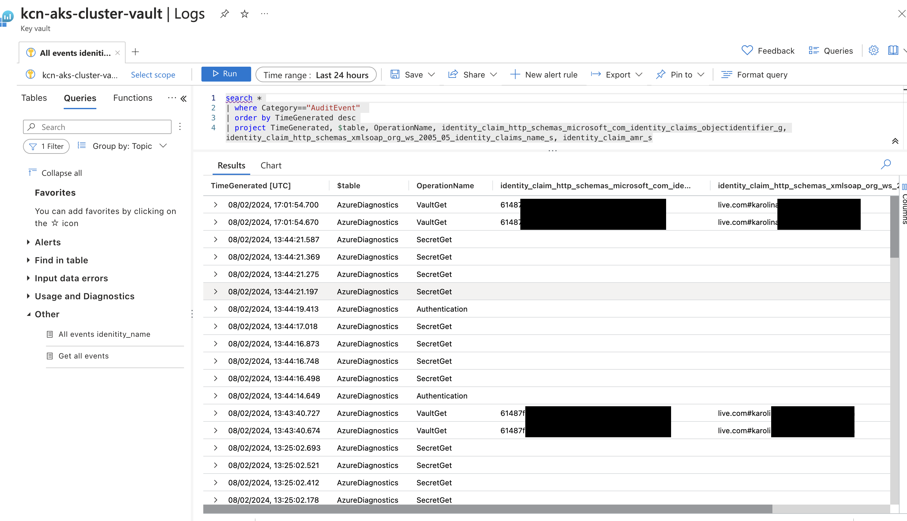

# Secrets management with Azure Key Vault

## Key Vault settings and setup

A new Key Vault was created to store sensitive information required by the application, linked to the subscription and resource group used throughout the project. The location selected also matched the location selected for other resources in the cluster, and was set to the nearest geographically for low latency. Key Vault's permission model was left as default RBAC (Azure role-based access control (recommended)), as were remaining settings.

### Permission settings

In order to gain full control over the Key Vault the main user was assigned a **_Key Vault Administrator_** role. Administrators can manage access policies, configure advanced settings, and perform any operation within the Key Vault.

In addition to this, a Key Vault Secrets Officer role was assigned to **_Managed Identity_** (created already while setting up metrics in the Azure Monitor). The identity is used to authenticate the Orders app while the assigned role allows it access to retrieve secrets from the Key Vault.
Command use for this step is below:

```bash
# Assign "Key Vault Secrets Officer" role to Managed Identity
az role assignment create --role "Key Vault Secrets Officer" \\
  --assignee <my-managed-identity-client-id> \\
  --scope /subscriptions/{my-subscription-id}/resourceGroups/networking-rg/providers/Microsoft.KeyVault/vaults/{key-vault-name}
```

## Adding secrets to the Vault
Hardcoding sensitive information into an app poses serious security risks and is not a good practice. For this reason the information required by the app to connect to the database has been moved to Key Vault. These are: 

- server uri address where the database can be accessed
- the name of the database
- username and 
- password allowing access to the database

All of these are required to make connection to and interact with the database.

## Integrating with application in Python 

<!-- Document the modifications made to the application code to incorporate manage identity credentials for secure retrieval of database connection details-->

Integration of the Key Vault with the app, required installation of two additional libraries: `azure-identity` and `azure-keyvault-secrets`. These were added to the `requirements.txt` file.

Next, the `app.py` file was updated to set up connection with Azure Key Vault and replacing the hardcoded values for server uri, database name, username, and password with values retrieved from the KayVault:

Added two additional imports to the file:

```python
    from azure.identity import DefaultAzureIdentity
    from azure.keyvault.secrets import SecretClient    
```

Set up connection with the Key Vault

```python
    key_vault_url = https://my-vault-name.vault.azure.net/
    <!-- credential = DefaultAzureCredential() -->
    secret_client = SecretClient(vault_url=key_vault_url, credential=credential)

    # Access the secret values from Key Vault
    example_secret = secret_client.get_secret("my-secret-name").value
```

## Testing and troubleshooting
When attempting to run the application 

The initial setup of the credentials using ManagedIdentityCredential raised an error:

```bash
raise CredentialUnavailableError(error_message) from ex azure.identity._exceptions.CredentialUnavailableError: ManagedIdentityCredential authentication unavailable, no response from the IMDS endpoint.
```

**Steps taken**: Researched Azure documentation and other resources on the subject (including Stackoverflow and Github). 
**Reason for issue**: Managed Identity due its very nature does not work locally.
**Fixed**: Replaced ManagedIdentityCredential in the code with DefaultAzureCredential, which goes down a list of all possible authorisation methods. 
**Testing**: Run the application locally with `python app.py` as well as using port forwarding once app was redeployed with changes, and fully tested functionality. In both cases, no issues with app were identified.

 In an attempt to ascertain which credentials are used for accessing the vault to ensure Managed Identity is picked up when deployed, set up monitoring and investigated EventAudit log for information. Investigation revealed that while accessing the Key Vault from local implementation, KeyVault log is updated and shows the identity claim to be Azure account used to access Azure locally, while when app is running from the cluster, access is not registered in the logs at all, implying that Monitor Identity is used. 
 This can be potentially further verified by checking activity logs for the Identity itself or Authentication methods provided having correct permissions. 




<!-- Finally, checkout the UML diagram for the architecture you just build here  and make sure to add this to your GitHub repository. Review your README file with the aid of the UML diagram and make any necessary updates to ensure a detailed documentation of your project experience. -->


