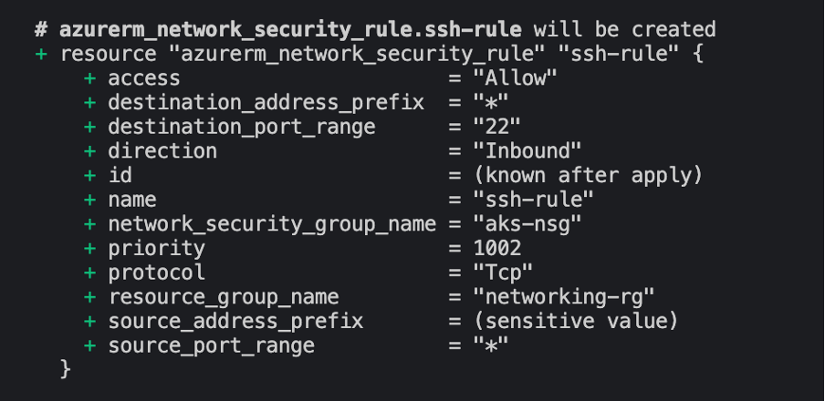

# Terraform project setup

## **networking-module**

This module provisions networking components in the Azure Networking Services needed to support the AKS cluster. These components include:
- _Virtual Network (VNet)_: the foundation of the AKS cluster defining IP address space as 10.0.0.0/16<sup>*</sup>.
- two _subnets_ :
    - control-plane-subnet: running on 10.0.1.0/24 within the main vnet and dedicated to hosting the AKS cluster's control plane components.
    - worker-nodes-subnet: running on 10.0.2.0/24 (to prevent conflicts with the first subnet) where the cluster's worker nodes will be hosted.
- _Networking Security group (NSG)_ with two rules for inbound traffic:
    - kube-apiserver-rule Port (TCP/443) which enables access to the cluster from a specified public IP address using `kubectl`.
    - SSH Port (TCP/22) which allows SSH access to the nodes for troubleshooting and administrative purposes from the specified public IP address.

<sup>*</sup>NOTE: all address spaces are defined using CIDR (Classless Inter-Domain Routing) notation where the number after slash indicates the subnet mask, specifying the number of bits in the address space that cannot be changed. 10.0.0.0/16 gives an address space range between 10.0.0.0 and 10.0.255.255 while subnet masks give ranges between 10.0.1.0 and 10.0.1.255 and 10.0.2.0 and 10.0.2.255.
***

### Module variables
<span style="color:#10a292; font-size:1.1em;">Input variables</span>
|Variable name|Description|
|-------------|-----------|
|`resource_group_name`| The name of the resource group for the project.|
|`location`| The Azure region where the resources will be deployed.|
|`vnet_address_space`| The address space used for the virtual network.|
|`source_ip`| The source IP address for use in the network security rule.|

<span style="color:#10a292; font-size:1.1em;">Output variables</span> (required for the aks-cluster-module)
|Variable name|Description|
|-------------|-----------|
|`vnet_id`| The ID of the created virtual network.|
|`control_plane_subnet_id`| The ID of the created control plane subnet.|
|`worker_node_subnet_id`| The ID of the created worker node subnet.|
|`networking_resource-group-name`| The name of the created resource group with the networking resources.|
|`aks_nsg_id`| The ID of the created network security group for the AKS cluster.|

## **aks-cluster-module**

This module specifies the AKS cluster resources necessary to provision the AKS cluster.
Apart from creating the cluster, the code also defines the default node pool with the following parameters: 

- default count set to one
- size of the virtual machine as Standard_DS2_v2
- enabled auto-scaling with minimum number of nodes set to 1 and maximum to 3 to support increases in traffic

Service principal block provides authentication details needed to access Azure and provision the cluster.
***

### Module variables

<span style="color:#10a292; font-size:1.1em;">Input variables</span>

|Variable name|Description|
|-------------|-----------|
|`aks_cluster_name`| The name of the AKS cluster.|
|`cluster_location`| The Azure region where the AKS cluster will be deployed.|
|`dns_prefix`| The DNS prefix specified when creating the AKS cluster.|
|`kubernetes_version`| The version of Kubernetes to use for the AKS cluster.|
|`service_principal_client_id`| The Client ID for the service principal associated with the cluster.|
|`service_principal_secret`| The Client Secret for the service principal.|
|`resource_group_name`*| The name of the resource group in which to create the AKS cluster.|
|`vnet_id`*| The ID of the VNet in which to create the AKS cluster.|
|`control_plane_subnet_id`*| The ID of the subnet in which to create the AKS cluster control plane.|
|`worker_node_subnet_id`*| The ID of the subnet in which to create the AKS cluster worker nodes.|
|`aks_nsg_id`*| The ID of the NSG to associate with the AKS cluster|

*_Variables defined as output in the networking-module, required as input values to provision the cluster_

<span style="color:#10a292; font-size:1.1em;">Output variables</span>
|Variable name|Description|
|-------------|-----------|
|`aks_cluster_name`| The name of the AKS cluster.|
|`aks_cluster_id`| The ID of the AKS cluster.|
|`aks_kubeconfig`| The Kubernetes configuration file of the AKS cluster essential for interacting with and managing the AKS cluster using kubectl.|


## Main Configuration
The _main.tf_ configuration file for the project contains code that:
- sets up the provider for the project as AzureRM v.3.0.0;
- provides authentication details for accessing Azure platform (see [Handling sensitive information](#handling-sensitive-information) section below);
- links networking module to the main project, providing values for the `resource_group_name`, `location and vnet_address_space`;
- links the cluster module to the main project, providing values for the `aks_cluster_name`, `cluster_location`, `dns_prefix, kubernetes_version`.

<span style="color:#10a292; font-size:1.1em;">Input variables</span>

|Variable name|Description|
|-------------|-----------|
|`client_id`| Access key for the provider|
|`client_secret`| Secret key for the provider|
|`subscription_id`| Subscription ID for the provider|
|`tenant_id`| Tenant ID for the provider|
|`source_ip`| The source IP address for use in the network security rule|

All variables specified above have "sensitive" attribute set to `true`.


## Handling sensitive information

As a way of protecting sensitive information, Terraform offers an option to store these in a .tfvars file. The values, rather than being hardcoded into the code, can be pulled in at runtime using a `-var-file="<terraform>.tfvars` flag when running `terraform plan` or `apply` commands, e.g.:
```bash     
# plan actions
terraform plan -var-file="mysecrets.tfvars"
# apply actions
terraform apply -var-file="mysecrets.tfvars"
```

In this project, we used this solution to protect the values of: 
- `var.source_ip`, used in the security rules to allow access to the cluster from the user's machine/IP address and
- information required for authorization (i.e. `client_id`, `client_secret`, `subscription_id` and `tenant_id`).

The variables are also tagged as "sensitive", preventing terraform from showing their values in the *plan* and **apply* commands - `(sensitive value)` is shown instead as illustrated in the image below. 



Despite these precautions, sensitive information is still visible in the state files created when running `terraform apply -var-file="mysecrets.tfvars"`. To prevent their exposure the state files were excluded from git tracking, by adding `*.tfstate*` to the .gitignore file