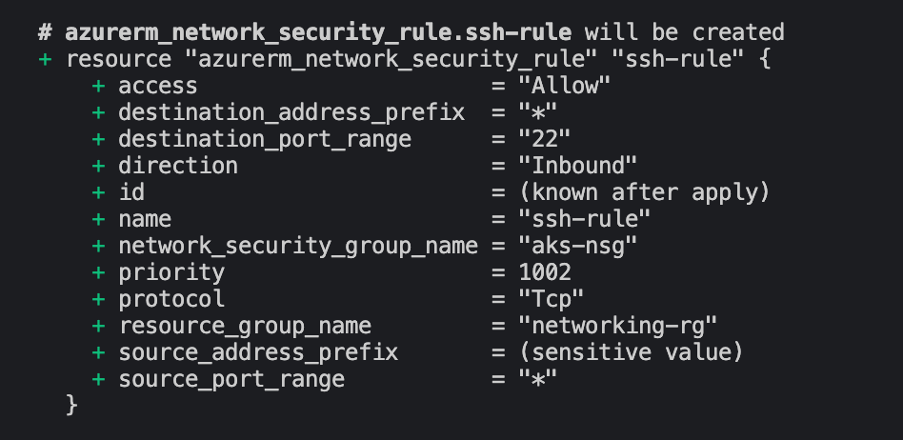

# Web-App-DevOps-Project

Welcome to the Web App DevOps Project repo! This application allows you to efficiently manage and track orders for a potential business. It provides an intuitive user interface for viewing existing orders and adding new ones.

## Table of Contents

- [Features](#features)
- [Getting Started](#getting-started)
- [Technology Stack](#technology-stack)
- [Docker Image and Containerization process](#docker-image-and-containerization-process)
- [Terraform (IaC)](#Terraform-(IaC))
- [Contributors](#contributors)
- [License](#license)

## Features

- **Order List:** View a comprehensive list of orders including details like date UUID, user ID, card number, store code, product code, product quantity, order date, and shipping date.
  

- **Pagination:** Easily navigate through multiple pages of orders using the built-in pagination feature.
  

- **Add New Order:** Fill out a user-friendly form to add new orders to the system with necessary information.
  

- **Data Validation:** Ensure data accuracy and completeness with required fields, date restrictions, and card number validation.

## Features pending implementation
- **Delivery Date:** A column to track delivery dates for orders. Can be used to gain valuable insights into various metrics, e.g.:
    - Track the number of orders made/shipped vs. delivered.
    - Track the success rate of deliveries per user to identify potential issues with addresses/unwanted customer behaviour.
    - In conjunction with Shipping Date, can be used to track 'time-to-delivery' providing valuable insights into potential issues with delivery service providers/bottlenecks.
    - Track and compare the performance (delivery succes/time-to-delivery) of various delivery service providers, etc.
    
    The feature was implemented successfully in feature branch `feature/add-delivery-date` and is ready to be merged into the production branch when required (provided there are no merge conflicts).

    NOTE: It is recommended that additional functionality implementing solutions mentioned above are done in separate branch(es).
    
    [Screenshot to be added]

## Getting Started

### Prerequisites

For the application to succesfully run, you need to install the following packages:

- flask (version 2.2.2)
- pyodbc (version 4.0.39)
- SQLAlchemy (version 2.0.21)
- werkzeug (version 2.2.3)

### Usage

To run the application, you simply need to run the `app.py` script in this repository. Once the application starts you should be able to access it locally at `http://127.0.0.1:5000`. Here you will be meet with the following two pages:

1. **Order List Page:** Navigate to the "Order List" page to view all existing orders. Use the pagination controls to navigate between pages.

2. **Add New Order Page:** Click on the "Add New Order" tab to access the order form. Complete all required fields and ensure that your entries meet the specified criteria.

## Technology Stack

- **Backend:** Flask is used to build the backend of the application, handling routing, data processing, and interactions with the database.

- **Frontend:** The user interface is designed using HTML, CSS, and JavaScript to ensure a smooth and intuitive user experience.

- **Database:** The application employs an Azure SQL Database as its database system to store order-related data.

## Docker Image and Containerization process

The app has been containerized &mdash; packaged up with all its code, dependencies, necessary executables and configuration files &mdash; to facilitate easy and quick deployment.

Containerization has many benefits. Because containers encapsulate applications with all their dependencies, they run consistently irrespective of the end user's operating system or environment. This isolation of the container's content promotes security and prevents conflicts between applications and libraries. Containers are also highly portable and efficient. They can be easily run on any machine(s) now matter what its underlying infrastructure, and becuase they share the host's OS kernel, they do not take up unnecessary resources and are very lightweight.

These advantages are especially important in a DevOps setting, where applications are deployed across different environments (e.g. development, test, production) and shared between developers working on machines with different OS and hardware. Their small and lightweight nature make continuous deployment easy, and because they can be used together to build larger multi-container applications they offer great flexiblity and scalability.

### Prerequisities

In order to run this container you'll need docker installed.

* [Windows](https://docs.docker.com/windows/started)
* [OS X](https://docs.docker.com/mac/started/)
* [Linux](https://docs.docker.com/linux/started/)

### Install and setup

You can either pull the image prepared for you from DockerHub using `docker pull koko660/flask-orders-app` command or build the image yourself. The steps taken to containerize the application are described in detail in [_Containerization process.md_](https://github.com/Koko-66/Web-App-DevOps-Project/blob/main/Containerization%20process.md).

### Usage

#### Container Parameters and Environment Variables

v1.0: none required

### Versioning

Latest image: flask-orders-app:v1.0 

## Terraform (IaC)

Terraform is an Infrastructure as Code tool allowing to define and provision the infrastructure resources (e.g. virtual machines, networks, and databases) in a declarative way using code. The code defines the infrastructure configurations, which can then be executed to create, modify, or destroy the specified resources.

IaC is a powerfull tool in the hands of DevOps enabling automation, version control, reusability and consistency in the provisioning and management of infrastructure resources.

Terraform is used in this project to provision Azure resources needed to run the app on Azure Kubernetes Service (AKS). It comprises two modules: networking-module and aks-cluster-module. 

### 1. **networking-module**

This module provisions networking components in the Azure Networking Services needed to support the AKS cluster. These components include:
- _Virtual Network (VNet)_: the foundation of the AKS cluster defining IP address space as 10.0.0.0/16*.
- two _subnets_ :
    - control-plane-subnet: running on 10.0.1.0/24 within the main vnet and dedicated to hostng the AKS cluster's control plane components.
    - worker-nodes-subnet: running on 10.0.2.0/24 (to prevent conflicts with the first subnet) where the cluster's worker nodes will be hosted.
- _Networking Security group (NSG)_ with two rules for inbound traffic:
    - kube-apiserver-rule Port (TCP/443) which enables access to the cluster from a specified public IP address using `kubectl`.
    - SSH Port (TCP/22) which allows SSH access to the nodes for troubleshooting and amdinistrative purposes from the specified public IP address.

*NOTE: all address spaces are defined using CIDR (Calssless Inter-Domain Routing) notation where the number after slash indicates the subnet mask, specifying the number of bits in the address space that cannot be changed. 10.0.0.0/16 gives an address space range between 10.0.0.0 and 10.0.255.255 while subnet maks give a range between 10.0.1.0 and 10.0.1.255 and 10.0.2.0 and 10.0.2.255.
***

### Module variables
Input variables
|Variable name|Description|
|-------------|-----------|
|`resource_group_name`| The name of the resource group for the project.|
|`location`| The Azure region where the resources will be deployed.|
|`vnet_address_space`| The address space used for the virtual network.|
|`source_ip`| The source IP address for use in the network security rule.|

Output variables (required for the aks-cluster-module)
|Variable name|Description|
|-------------|-----------|
|`vnet_id`| The ID of the created virtual network.|
|`control_plane_subnet_id`| The ID of the created control plane subnet.|
|`worker_node_subnet_id`| The ID of the created worker node subnet.|
|`networking_resource-group-name`| The name of the created resource group with the networking resources.|
|`aks_nsg_id`| The ID of the created network security group for the AKS cluster.|

### Handling sensitive information

In order to protect sensitive iformation Terraform offers an option to store sensitive information in a .tfvars file. The values, rather than being hardcoded into the code, can be then pulled at runtime using a `-var-file="<terraform>.tfvars` flag when running `terraform plan` or `apply` commands, e.g. `terraform plan -var-file="mysecrets.tfvars"`. In this part of the project, we used this solution to protect the value of `var.source_ip`, used in the security rules to allow access to the cluster from the user's machine/IP address. The variable is also tagged as `sensitive`, preventing terraform from showing it in the `plan` and `apply` commands output.

### 2. **aks-cluster-module**: to provision the AKS cluster.

This module specifies the AKS cluster resources necessary to provision the AKS cluster. 
Apart from creating the cluster, the code also defines the default node pool with the following parameters: 

- default count set to one
- size of the virtual machine as Standard_DS2_v2
- enabled auto-scaling with minimum number of nodes set to 1 and maximum to 3 to support increases in traffic

Serivce principal block provides authentication details needed to access Azure and provision the cluster.
***

### Module variables

Input variables

|Variable name|Description|
|-------------|-----------|
|`aks_cluster_name`| The name of the AKS cluster.|
|`cluster_location`| The Azure region where the AKS cluster will be deployed.|
|`dns_prefix`| The DNS prefix specified when creating the AKS cluster.|
|`kubernetes_version`| The version of Kubernetes to use for the AKS cluster.|
|`service_principal_client_id`| The Client ID for the service principal associated with the cluster.|
|`service_principal_secret`| The Client Secret for the service principal.|
|`resource_group_name`*| The name of the resource group in which to create the AKS cluster.|
|`vnet_id`*| The ID of the VNet in which to create the AKS cluster.|
|`control_plane_subnet_id`*| The ID of the subnet in which to create the AKS cluster control plane.|
|`worker_node_subnet_id`*| The ID of the subnet in which to create the AKS cluster worker nodes.|

*_Variables defined as output in the networking-module, required as input values to provision the cluster_

Output variables
|Variable name|Description|
|-------------|-----------|
|`aks_cluster_name`| The name of the AKS cluster.|
|`aks_cluster_id`| The ID of the AKS cluster.|
|`aks_kubeconfig`| The Kubernetes configuration file of the AKS cluster essential for interacting with and managing the AKS cluster using kubectl.|

## Contributors 

- [Maya Iuga](https://github.com/maya-a-iuga)
- [Koko-66](https://github.com/koko-66)

## License

This project is licensed under the MIT License. For more details, refer to the [LICENSE](LICENSE) file.
