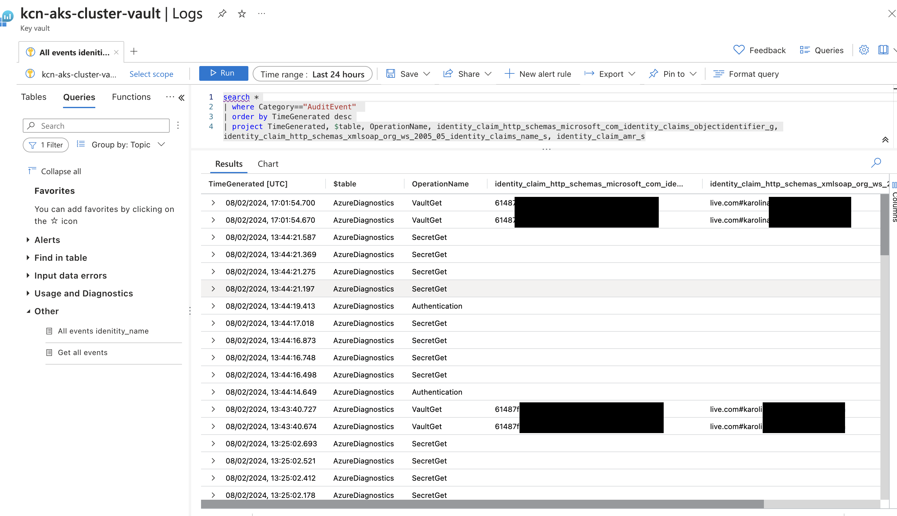

# Secrets management with Azure Key Vault

## Key Vault settings and setup

To provide secure storing sensitive information required by the application a new Key Vault was created and linked to the subscription and resource group used throughout the project. The location selected for the vault also matched the location selected for other resources in the cluster, and was set to the nearest geographically for low latency. Key Vault's permission model was left as default RBAC (Azure role-based access control), as were the remaining settings.

### Permissions and access settings

In order to gain full control over the Key Vault the main user was assigned a **_Key Vault Administrator_** role. Administrators can manage access policies, configure advanced settings, and perform any operation within the Key Vault.

In addition to this, a **_Key Vault Secrets Officer_** role was assigned to the _Managed Identity_ (created already while setting up metrics in the Azure Monitor). The identity is used for authentication when the Orders app requests secrets from the Key Vault, while the assigned role allows it access to retrieve them.

Command use for this step is below:

```bash
# Assign "Key Vault Secrets Officer" role to Managed Identity
az role assignment create --role "Key Vault Secrets Officer" --assignee <my-managed-identity-client-id> --scope /subscriptions/{my-subscription-id}/resourceGroups/networking-rg/providers/Microsoft.KeyVault/vaults/{key-vault-name}
```

## Adding secrets to the Vault
Hardcoding sensitive information into an app poses serious security risks and is not a good practice. For this reason the information required by the app to connect to the database has been moved to Key Vault. These are: 

- server uri address where the database can be accessed,
- the name of the database,
- username and 
- password allowing access to the database.

All of these are required to make connection to and interact with the database.

## Integrating with application in Python 

<!-- Document the modifications made to the application code to incorporate manage identity credentials for secure retrieval of database connection details-->

Integration of the Key Vault with the app, required installation of two additional libraries: `azure-identity` and `azure-keyvault-secrets`. These were added to the `requirements.txt` file.

Next, the `app.py` file was updated to set up connection with Azure Key Vault and replace the hardcoded values for server uri, database name, username, and password with values retrieved from the KayVault:

Added two additional imports to the file:

```python
    from azure.identity import DefaultAzureIdentity
    from azure.keyvault.secrets import SecretClient    
```

Set up connection with the Key Vault

```python
    # Set up Azure Key Vault
    key_vault_url = "https://kcn-aks-cluster-vault.vault.azure.net/"

    # Set up Azure Key Vault client with Managed Identity
    credential = DefaultAzureCredential()
    secret_client = SecretClient(vault_url=key_vault_url, credential=credential)

    # Access the secret values from Key Vault - example
    example_secret1 = secret_client.get_secret("my-secret-name").value
    example_secret2 = secret_client.get_secret("my-secret-name2").value
```

## Testing and troubleshooting
To ensure that the integration was successful, the app was tested first locally and then once redeployed with the help of Pipeline. 

### Issues found

**Issue**: The initial setup of the credentials using `ManagedIdentityCredential` raised an error when running app locally:

```bash
raise CredentialUnavailableError(error_message) from ex azure.identity._exceptions.CredentialUnavailableError: ManagedIdentityCredential authentication unavailable, no response from the IMDS endpoint.
```

**Reason for issue**: After investigation and searching Azure documentation, GitHub and StackOverflow entries, it was determined that Managed Identity due to its very nature does not work locally.

**Solution**: Replaced `ManagedIdentityCredential` in the code with `DefaultAzureCredential`, which attempts all possible authorisation methods in order.

**Testing**: Run the application locally with `python app.py` as well as using port forwarding once app was redeployed with changes, and fully tested functionality. In both cases, no issues with app were identified.

---

### Further investigation

 In an attempt to ascertain which credentials are used for accessing the vault to ensure Managed Identity is picked up when deployed, monitoring was set up for the Key Vault and EventAudit log investigated for information. 
 
 Investigation revealed that while accessing the Key Vault from local implementation, KeyVault log is updated and shows the identity claim as the Azure account used to access Azure locally. However, when app is running from the cluster (accessed locally with port forwarding) no new events are registered in the logs, implying that Monitor Identity is used. 



 This can be potentially further verified by checking activity logs for the Identity itself or Authentication methods which were not completed here due to permission restrictions.


